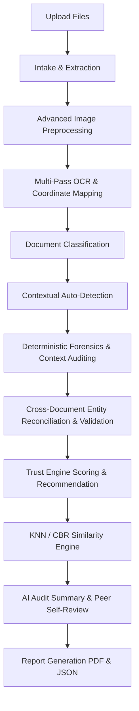

# Anobis: Enterprise-Grade Document Fraud & Forensics Architecture

This document provides a comprehensive technical breakdown of the **Anobis** document forensics and forensic investigation platform.

---

## 1. Architectural Philosophy
Anobis is built on an **Investigation-Centric Lifecycle**. Traditional document classifiers analyze documents in isolation. Anobis recognizes that financial fraud and identity tampering are rarely contained in a single document; instead, fraud is discovered in the **contradictions** between documents (e.g., name discrepancies between ID cards and payslips) or **contextual mathematical anomalies** (e.g., bank statements where transaction math fails).

The core unit of work is an **Investigation**, which acts as a container for:
- Multiple uploaded files (PDFs, PNGs, JPGs).
- Extracted text, metadata, and structured entities.
- Deterministic forensic **Findings** supported by page-level, coordinate-specific **Evidence**.
- Dynamic similarity mappings (Case-Based Reasoning via KNN).
- Grounded bilingual AI audit narratives (English & Hindi) with peer self-review.

---

## 2. End-to-End Pipeline Pipeline Execution Flow

When an investigation is initiated (`POST /api/v1/investigations/{id}/analyze`), an asynchronous worker executes the multi-stage pipeline:



### Stage 1: Intake & Conversion
- **Module:** `layers/intake/`, `layers/extraction/document_converter.py`
- **Actions:** Stores files under `uploads/`. Word documents (`.docx`) are converted to PDF; image files (`.png`, `.jpg`, `.jpeg`) are preprocessed and saved as PDF pages using Pillow.

### Stage 2: Advanced Image Preprocessing
- **Module:** `layers/extraction/extraction_service.py` (`_preprocess_image`)
- **Actions:** Scanned images or PDF page images are preprocessed to improve OCR quality:
  1. **Upscaling:** Cubic interpolation (`cv2.INTER_CUBIC`) is applied if page width is < 1500px.
  2. **Contrast Enhancement:** Contrast Limited Adaptive Histogram Equalization (CLAHE) is run with `clipLimit=2.0`.
  3. **Denoising:** Bilateral filtering (`cv2.bilateralFilter`) is applied to reduce noise while maintaining sharp text edges.

### Stage 3: Multi-Pass OCR & Coordinate Mapping
- **Module:** `layers/extraction/extraction_service.py`
- **Actions:** Scanned files undergo Tesseract OCR.
  - **OCR Cache:** To avoid repeating expensive OCR tasks, the system hashes file bytes (SHA-256) and stores outputs in `uploads/ocr_cache/{hash}.json` and `uploads/ocr_cache/{hash}.pdf`.
  - **Orientation Detection:** Applies Tesseract OSD (Orientation and Script Detection) to auto-rotate misaligned scans.
  - **Bilingual Support:** Pulls `ocr_language` settings (`eng`, `hin`, or `eng+hin`).
  - **Adaptive OCR Retry:** If a document is classified as `PAN` or `Aadhaar` but fails to yield a valid identifier, a second pass is executed at 3.0x scale rendering, applying **CV2 Adaptive Gaussian Thresholding** and forcing bilingual OCR.
  - **Searchable PDF Overlay:** Extracted characters are re-injected invisibly (`render_mode=3` in PyMuPDF) onto the PDF page at matching layout coordinates, producing a searchable PDF file.

### Stage 4: Document Classification
- **Module:** `layers/classification/document_classifier.py`
- **Actions:** Scores extracted text against keyword regex patterns to classify documents as `Bank Statement`, `Payslip`, `PAN`, `Aadhaar`, `Utility Bill`, `Lease Agreement`, or `Insurance Document`.

### Stage 5: Context Auto-Detection
- **Module:** `services/investigation_manager.py`
- **Actions:** If the case context is set to "Automatic Detection", the manager inspects document types to classify the investigation context (e.g., `Mortgage Underwriting` if title/property deeds exist, `Loan Approval` for statements/payslips, `Tenant Screening` for lease agreements, etc.).

### Stage 6: Deterministic Forensics & Context Auditing
- **Module:** `layers/forensics/`, `layers/context/`
- **PDF Structure Analyzer:** Counts `%%EOF` markers to flag multiple revision layers and detects `/Prev` pointers indicating incremental updates.
- **Signature Validator (Standalone):** Looks for `/Type /Sig`, `/ByteRange`, and `/Cert` dictionaries in the raw PDF streams.
- **Font Forensics (Standalone):** Analyzes font families to flag documents using > 4 distinct families, mixed consumer vs. proprietary fonts (e.g., Arial mixed with MICR/monospaced fonts), and inconsistent character sizes indicating number replacement.
- **Financial Math Validator:**
  - *Bank Statement Math:* Re-calculates sequences of 3 consecutive amounts. If running balances fail to sum up (`a ± b = c`) in > 30% of lines, it flags altered math.
  - *Payslip Math:* Verifies if `Gross - Deductions = Net` (within a $2.00 rounding threshold).
- **Statistical Auditing:**
  - *Benford's Law:* Analyzes first-digit distribution of transactions. If the digit '1' appears in < 5% of lines (normally ~30%), it flags statistical fabrication.
  - *Round Number Frequency:* Flags accounts where > 40% of transactions end perfectly in `.00`, indicating manually fabricated records.
- **Date Consistency (Standalone):** Scans for future-dated transactions, impossible dates (e.g., Feb 30th), or inconsistent date formatting inside a single document.
- **Real Estate signals:** Checks documents for 34 domain-specific flags (e.g., phantom rental income, straw buyers, collusive appraisals, earnest money anomalies) categorized by severity.

### Stage 7: Cross-Document Validation
- **Module:** `layers/cross_document/`
- **Normalization:** Normalizes names, addresses, and employer strings (standardizes titles, suffixes, and punctuation).
- **Fuzzy Matching:** Uses Levenshtein ratio and Jaro-Winkler distance to evaluate entity consistency.
- **Abbreviation Handling:** Automatically matches initials to full names (e.g., "R. Sharma" and "Rahul Sharma" match with a 0.96 score).
- **Employer Verification:** Uses Token-Set-Ratio matching (requires > 75% similarity).
- **Income Consistency:** Compares net pay values across multiple payslips.
- **Entity Reconciliation:** If Doc A has a complete validated name and Doc B has a partial name (Jaro-Winkler similarity >= 85%), it automatically reconciles Doc B's name field in database records to improve subsequent matches.

---

## 3. Trust Engine & Recommendation Matrix

The **Trust Engine** aggregates findings into a final, explainable 0-100 score:

- **Base Score:** 100.0
- **Deductions:** High Severity = -35; Medium Severity = -18; Low Severity = -8.
- **Source Multipliers:** 
  - `FORENSIC` flags: 1.0x
  - `CROSS_DOC` flags: 0.9x
  - `CONTEXT` flags: 0.8x
  - `KNN` similarity flags: 0.5x
- **Deduction Caps:** Low deductions are capped at 25.0; Medium deductions are capped at 50.0. High deductions are uncapped.
- **Bonuses:** 
  - +5.0 if all expected documents for the context are present.
  - +5.0 if no High/Medium cross-document anomalies are detected.
- **Recommendation Routing:**
  - `AUTO_APPROVE`: Trust Score >= configured threshold (default 85) AND `auto_approve_cases` is enabled in settings.
  - `HIGH_RISK_MANUAL_REVIEW`: Trust Score < 50.
  - `MANUAL_REVIEW`: All other cases.

---

## 4. Forensic KNN Similarity Engine

Matches completed investigations against baseline case patterns using Case-Based Reasoning (CBR):

- **Feature Vectors:** Generated dynamically using 7 feature weights:
  - `trust_score` (40%)
  - `ocr_confidence` (10%)
  - `metadata_score` (15%)
  - `revision_count` (5%)
  - `salary_consistency` (10%)
  - `identity_similarity` (10%)
  - `employer_consistency` (10%)
- **Match Boosters:** Offers string matching bonuses (+5% for matching PDF Producer, +5% for matching Editing Software, +10% for matching Case Context).
- **Search Targets:**
  - Precompiled references (Genuine clean statements vs. Altered fraud templates).
  - Database historical cases.
  - Manually approved/promoted trusted baselines in `trusted_repository/data.json`.
- **Auto-Learning:** If `auto_baseline_learning` is active, cases scoring above the trust threshold are automatically registered to the trusted repository as new baseline references.

---

## 5. AI Provider Routing & Summaries

The **AI Summary Layer** (`layers/ai/summary_generator.py`) generates bilingual summaries (English and Hindi) based on deterministic metrics:

- **Routing Logic:** Resolved dynamically by the `AIProviderManager`:
  - **Enhanced Mode (Gemini API):** Calls `gemma-4-31b-it` at `https://generativelanguage.googleapis.com` if `ai_mode` is set to "enhanced" and a Gemini key is configured.
  - **Offline Mode (Local Ollama):** Calls local Ollama (defaults to `gemma-4-31b-it`) at `http://localhost:11434`.
  - **Provider Fallback:** If a Gemini API call fails (network issue, rate limit), the manager automatically falls back to local Ollama.
  - **Deterministic Fallback:** If Ollama is offline or the model is missing, the pipeline falls back to a deterministic, template-based JSON summary in English and Hindi to guarantee zero-crash execution.
- **AI Peer Self-Review:** When enabled, the manager runs a secondary peer review request through the model to identify hallucinations or unsupported claims in the initial draft, appending corrections to the final summary.

---

## 6. Relational Database Schema

SQLite schema mappings managed via SQLAlchemy:

```text
    +----------------------------------+
    |           investigations         |
    +----------------------------------+
    | id (PK)                          |
    | title, context, status           |
    | progress, current_stage          |
    | trust_score, recommendation      |
    | ai_summary_json (JSON)           |
    | is_baseline (BOOLEAN)            |
    | created_at, updated_at           |
    +----------------------------------+
         |      |               |
         |      |               |
     1:N |  1:N |           1:N |
         |      |               +-----------------------+
         |      v                                       v
         |  +-----------------------+               +-----------------------+
         |  |   investigation_events|               |         reports       |
         |  +-----------------------+               +-----------------------+
         |  | id (PK)               |               | id (PK)               |
         |  | investigation_id (FK) |               | investigation_id (FK) |
         |  | timestamp, event_type |               | report_url            |
         |  | message, metadata_json|               +-----------------------+
         |  +-----------------------+
         v
    +-----------------------+  1:N  +-----------------------+
    |       documents       |------>|        evidence       |
    +-----------------------+       +-----------------------+
    | id (PK)               |       | id (PK)               |
    | investigation_id (FK) |       | finding_id (FK)       |<--+
    | filename, file_type   |       | document_id (FK)      |   |
    | storage_path          |       | page_number           |   |
    | classification        |       | coordinates (JSON)    |   | 1:N
    | extracted_text (TEXT) |       | confidence, text      |   |
    | metadata_json (JSON)  |       | description           |   |
    | entities_json (JSON)  |       +-----------------------+   |
    +-----------------------+                                   |
         |                                                      |
         | 1:N                                                  |
         v                                                      |
    +-----------------------+                                   |
    |        findings       |-----------------------------------+
    +-----------------------+
    | id (PK)               |
    | investigation_id (FK) |
    | layer_source          |
    | name, severity, desc  |
    | metadata_json (JSON)  |
    +-----------------------+
```

---

## 7. Pipeline Integration Status

| Module | Purpose | Status | Details |
| :--- | :--- | :--- | :--- |
| **Extraction Service** | PDF/Image intake and OCR conversion | **Integrated** | Preprocessing (CLAHE, Bilateral) + OCR caching. |
| **Adaptive OCR Retry** | Sharpening characters for poor-quality scans | **Integrated** | Runs Gaussian Thresholding + 3.0x scaling. |
| **PDF Structure check** | Finds %%EOF and /Prev pointers | **Integrated** | Built-in to Digital Forensics layer. |
| **Digital Forensics ELA** | Fast OpenCV-based image tampering analysis | **Integrated** | Calculates standard deviation and mean difference. |
| **Financial Math Check** | Reconciles bank statement / payslip math | **Integrated** | Triple sequence checking + Gross-Ded-Net logic. |
| **Benford's Law** | statistical anomaly detection | **Integrated** | Evaluates first-digit distributions. |
| **Fuzzy Cross-Doc Match** | Normalizes and matches entities | **Integrated** | Jaro-Winkler with abbreviation fallback. |
| **Similarity Engine (KNN)** | Matches cases against CBR baselines | **Integrated** | Compares precompiled, DB, and JSON baselines. |
| **AI Summary Generator** | Formulates audit descriptions | **Integrated** | Gemini/Ollama switching + Self-Review. |
| **PDF Export** | Generates professional ReportLab reports | **Integrated** | Generates downloadable advisory audit report. |
| **Digital Signatures** | Cryptographic PDF validation | **Standalone** | Algorithms ready; designated for deep integration. |
| **Font Consistency** | Analyzes font origin anomalies | **Standalone** | Algorithms ready; designated for deep integration. |
| **Date Validator** | Future/Impossible date flags | **Standalone** | Algorithms ready; designated for deep integration. |
| **Complex Image Forensics**| ORB copy-paste clone detection | **Standalone** | Algorithms ready; designated for deep integration. |
