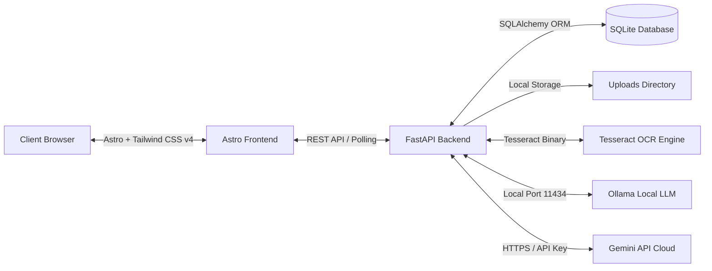
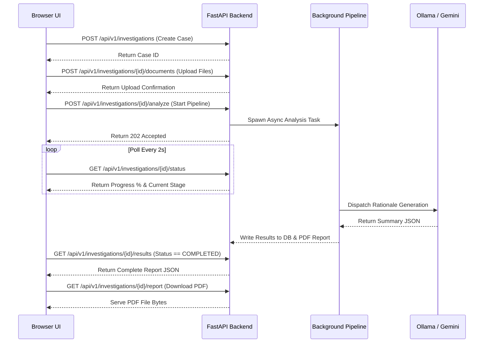
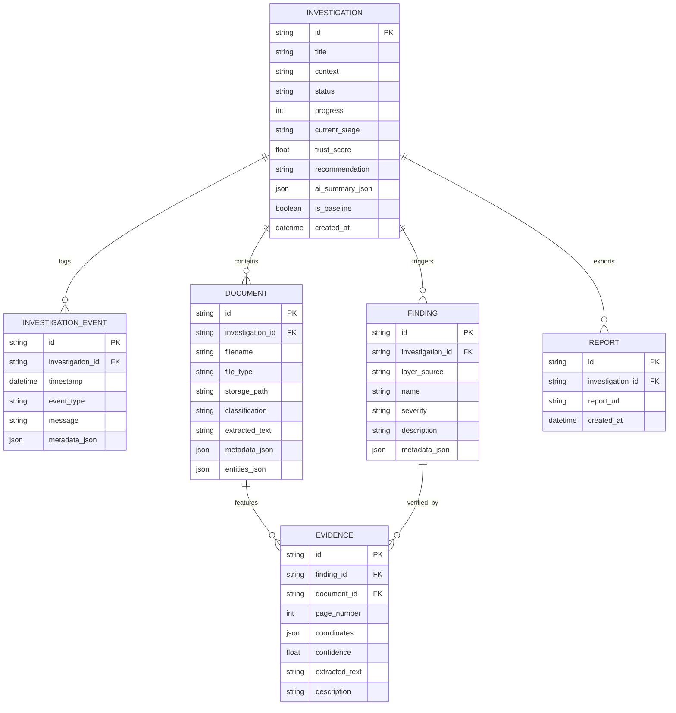

# ANOBIS

### Enterprise Document Fraud and Forensic Investigation Platform

[](https://opensource.org/licenses/MIT)
[](https://www.python.org/)
[](https://astro.build/)
[](https://tailwindcss.com/)
[](https://fastapi.tiangolo.com/)
[](https://ollama.com/)
[](https://ai.google.dev/)
[](https://www.sqlite.org/)
[](https://github.com/tesseract-ocr/tesseract)

---

## 🌌 Hero Section

**Anobis** is an enterprise-grade document fraud and forensic investigation platform designed for banking compliance, loan underwriting, tenant screening, insurance review, and audit teams.

### The Problem
Traditional document validation systems analyze files in isolation as individual classification inputs. However, modern financial fraud is rarely confined to a single document; it is found in the **contradictions** between documents (e.g., a payslip name that does not match an Aadhaar card) or **contextual mathematical anomalies** (e.g., bank statement transactions that do not calculate correctly). Furthermore, uploading sensitive financial documents to cloud-based validation APIs exposes institutions to serious data privacy, compliance, and sovereignty risks.

### The Solution
Anobis provides an **Investigation-Centric Workspace** that processes sets of documents as a single coordinated case. By combining advanced image preprocessing, bilingual OCR, digital forensics, cross-document entity reconciliation, and local LLM reasoning, Anobis uncovers sophisticated tampering attempts—all while operating **100% offline and local** to ensure absolute data privacy.

---

## 🌟 STAR Project Narrative

### Situation
Financial institutions handle thousands of loan applications, KYC folders, and audit bundles daily. Document tampering has become trivial with digital tools like Canva and Photoshop. Forgeries often look perfect to the naked eye and pass basic OCR checks, yet they contain mathematical discrepancies or metadata artifacts that manual reviewers miss. Security protocols prevent the use of cloud-hosted AI tools due to data privacy regulations (GDPR, DPDP, HIPAA), forcing teams to rely on slow, manual auditing.

### Task
Our goal was to build a secure, air-gapped forensic workspace that runs entirely on local hardware. The engineering requirements included:
1. Orchestrating a multi-stage async forensic pipeline in FastAPI.
2. Building an Astro 6.4 + Tailwind CSS v4 dashboard.
3. Automatically detecting structural PDF updates and image editing traces.
4. Extracting, validating, and fuzzy-matching identity and financial entities across files.
5. Computing an explainable, deterministic 0–100 Trust Score.
6. Generating grounded bilingual summaries (English and Hindi) using local models (Gemma) or Gemini API with offline fallbacks.

### Action
We designed and implemented a modular backend architecture alongside a high-density frontend:
- **Frontend Dashboard:** Built with Astro and Tailwind CSS v4, showcasing real-time analysis stages, interactive PDF/image previews, coordinates-mapped highlight overlays, audit timelines, and control settings.
- **Async Pipeline Worker:** Runs FastAPI background tasks that move investigations through extraction, classification, context-specific mathematics audits, cross-document fuzzy matching, and trust evaluation.
- **Advanced Image Preprocessing:** Integrates OpenCV and PIL to upscale images, enhance contrast via CLAHE, and apply bilateral filtering to clean text before OCR.
- **Multi-Pass OCR & Retry:** Integrates Tesseract OCR (with English and Hindi language support). If a critical identity document fails extraction, the system automatically triggers a second pass rendering at 3.0x scale with Adaptive Gaussian Thresholding.
- **Deterministic Forensics:** Evaluates PDF revision markers (`%%EOF`), modification histories, mixed consumer fonts, out-of-order date formats, Benford's Law distribution anomalies, and perfect round-number transaction ratios.
- **Cross-Doc Intelligence:** Leverages Jaro-Winkler, Levenshtein, and token-set-ratio matching to compare normalized entities, handle name abbreviations (e.g., "R. Sharma" vs. "Rahul Sharma"), and automatically reconcile partial name values.
- **AI Routing & Self-Review:** Dispatches JSON summary requests to local Ollama (`gemma-4-31b-it`) or Gemini API (`gemma-4-31b-it`), with automatic provider switching on failure. It features a secondary peer-review prompt to check for hallucinations and correct them.
- **Browser-Native TTS:** Utilizes the Web Speech API on the client side to read summaries aloud in English and Hindi.
- **PDF Report Generation:** Uses ReportLab to generate downloadable forensic audit reports complete with watermarks, OCR tables, and findings lists.

### Result
The final product is a production-ready, local-first forensic tool. It successfully uncovers sophisticated tampering attempts, calculates deterministic trust scores, and generates grounded summaries. By caching OCR outputs, the system optimizes execution times for repeated reviews. The entire stack starts with a single command (`make start`).

---

## 🛠️ Features Matrix

| Feature Group | Component | Implementation Status | Details |
| :--- | :--- | :---: | :--- |
| **Lifecycle** | Multi-Doc Investigation | **Implemented** | Groups files into a single case, runs async background analyses, and tracks progress. |
| **Intake** | Conversion & Cache | **Implemented** | Converts Word docs to PDF and renders images. Uses SHA-256 caching of OCR outputs to bypass redundant processing. |
| **OCR** | Advanced Preprocessing | **Implemented** | Grayscaling, upscaling, CLAHE contrast enhancement, and bilateral filtering. |
| **OCR** | Multi-Pass Retry | **Implemented** | Triggers 3.0x resolution rendering and CV2 Adaptive Gaussian Thresholding for failed ID extraction. |
| **OCR** | Searchable PDFs | **Implemented** | Embeds invisible OCR text back onto rendered PDF pages at precise coordinates. |
| **Forensics** | Metadata & Revision check | **Implemented** | Parses PDF structure for Canva/Photoshop signatures, `%%EOF` revision counts, and `/Prev` pointers. |
| **Forensics** | Digital Signatures | **Standalone** | Checks `/Sig`, `/ByteRange`, and `/Cert` dictionaries in raw PDF streams. |
| **Forensics** | Font origin & Sizing | **Standalone** | Detects mixed consumer/proprietary fonts and size discrepancies in numbers. |
| **Context** | Financial Mathematics | **Implemented** | Sequence triple balance calculation (`a ± b = c`) and Gross-Ded-Net validations. |
| **Context** | Statistical Auditing | **Implemented** | Evaluates transactions against Benford's Law and flags round-number anomalies. |
| **Context** | Real Estate Flags | **Implemented** | Includes 34 domain-specific indicators (earnests, straw buyers, occupancy verification). |
| **Context** | Date validator | **Standalone** | Flags impossible calendar dates, mixed formats, and future transactions. |
| **Cross-Doc** | Fuzzy Identity Match | **Implemented** | Compares names and IDs using Jaro-Winkler with abbreviation fallback. |
| **Similarity**| KNN Baseline Matching | **Implemented** | Case-Based Reasoning comparison against compiled templates, past DB logs, and JSON backups. |
| **AI Layer** | Routing & Fallbacks | **Implemented** | Dual routing (Ollama vs. Gemini API) with failovers and offline deterministic templates. |
| **AI Layer** | Peer Self-Review | **Implemented** | Uses a secondary model prompt to correct hallucinations or unsupported claims. |
| **Reporting** | ReportLab PDF Export | **Implemented** | Generates professional, watermark-stamped audit reports. |
| **UI Extras** | Native Web TTS | **Implemented** | Synthesizes speech client-side in the browser in English and Hindi. |

> [!NOTE]
> Features marked as **Standalone** have their core detection algorithms fully implemented and verified in the backend codebase (`layers/forensics/` and `layers/context/`), but are designated for deeper async integration in post-MVP pipelines.

---

## 📊 System Architecture

### 1. High-Level Architecture


### 2. Request & Polling Flow


### 3. Database Relationships


---

## 💻 Tech Stack

### Frontend Stack
| Technology | Version | Purpose |
| :--- | :--- | :--- |
| **Astro** | `^6.4.4` | Static & hybrid web framework, multi-page routing. |
| **Tailwind CSS** | `^4.3.0` | Global utility styling with modern CSS variable tokens. |
| **Lucide Astro** | `^0.556.0` | Forensic dashboard vector icons. |
| **Web Speech API** | Browser Native | Client-side Text-To-Speech reader in English & Hindi. |

### Backend Stack
| Technology | Version | Purpose |
| :--- | :--- | :--- |
| **FastAPI** | Modern | Restful API routing and async background task worker. |
| **Uvicorn** | Modern | Asynchronous HTTP web server. |
| **SQLAlchemy** | Modern | SQL Object Relational Mapping. |
| **SQLite** | Native | Serverless relational transactional database storage. |
| **PyMuPDF (fitz)** | Modern | PDF layout text extraction, PDF page image rendering, and searchable PDF re-building. |
| **Tesseract OCR** | System Binary | Local Optical Character Recognition (Eng + Hin). |
| **OpenCV** | headless | Advanced image processing (CLAHE, Bilateral, Thresholding). |
| **TheFuzz & Levenshtein** | Modern | Fuzzy matching algorithms for cross-document reconciliation. |
| **ReportLab** | Modern | Programmatic forensic PDF audit report compilation. |

---

## 📂 Repository Structure

```text
Real-Time-Anomaly_Detection/
├── dataset/                        # Reference cases for CBR similarity testing
│   ├── reference/                  # Ground truth document sets
│   └── testing/                    # Test cases (clean, fraud, ocr, tampered)
├── fraud_detection_system/
│   ├── backend/                    # Modular Python FastAPI REST API
│   │   ├── api/                    # Route endpoints controller (routes.py)
│   │   ├── core/                   # DB connection, configuration, provider routing
│   │   ├── layers/                 # Processing layers
│   │   │   ├── ai/                 # Summary generator and Peer Review logic
│   │   │   ├── classification/     # Keyword regex document classifier
│   │   │   ├── context/            # Math auditing, Benford's Law, real estate signals
│   │   │   ├── cross_document/     # Fuzzy matching, name reconciliation, normalizers
│   │   │   ├── extraction/         # Word-to-PDF, OpenCV filters, Tesseract, OCR Cache
│   │   │   ├── forensics/          # PDF analyzer, ELA checks, font & signature checkers
│   │   │   └── scoring/            # Severity deductions, trust scoring engine, KNN matching
│   │   ├── models/                 # SQLAlchemy DB schema & Pydantic models
│   │   ├── services/               # Pipeline managers, ReportLab engines, event loggers
│   │   ├── trusted_repository/     # Storage manager for approved baseline references
│   │   ├── uploads/                # Local file storage (uploads, caches, settings)
│   │   └── main.py                 # FastAPI application entry point
│   └── frontend/                   # Astro 6.4 + Tailwind CSS v4 Client Dashboard
│       ├── src/
│       │   ├── layouts/            # Global UI layout frame
│       │   ├── pages/              # Routing files (Dashboard, Investigations, Settings)
│       │   ├── services/           # Frontend API fetch services
│       │   └── styles/             # Tailwind global css configurations
│       └── package.json            # Node dependencies descriptor
├── scripts/
│   └── start-anobis.sh             # Auto-install and startup orchestrator launcher
├── Makefile                        # Dev runner commands mapping
├── ARCHITECTURE.md                 # Detailed technical backend architect guide
└── README.md                       # Submission documentation
```

---

## ⚙️ Configurable System Settings

Anobis stores configuration parameters in `uploads/settings.json`, editable via the UI:

| Setting Parameter | Default Value | Description |
| :--- | :--- | :--- |
| `ai_mode` | `"offline"` | AI provider strategy (`offline` for local Ollama, `enhanced` for Gemini API). |
| `ollama_url` | `"http://localhost:11434"` | Port URL for local Ollama container. |
| `ollama_model` | `"gemma-4-31b-it"` | Model used for local audit summary generation. |
| `gemini_api_key` | `""` | Key string for Gemini API cloud-hosted enhanced processing. |
| `min_trust_threshold` | `85.0` | Cutoff trust score below which manual review is triggered. |
| `baseline_similarity_threshold` | `60.0` | KNN similarity percentage to return matches. |
| `ocr_language` | `"en"` | Language option for OCR parsing (`en`, `hi`, `both`). |
| `max_ocr_retries` | `3` | Attempts to process illegible documents with CV2 Gaussian filters. |
| `cache_ocr` | `true` | Caches OCR outputs based on SHA-256 file hashes to optimize execution times. |
| `auto_baseline_learning` | `true` | Automatically promotes high-trust cases to the trusted KNN baseline repository. |
| `enable_cross_doc_matching` | `true` | Evaluates inconsistencies across the document bundle. |

---

## 🔌 REST API Endpoints Catalog

Base Path: `http://127.0.0.1:8001/api/v1`

### Investigation Endpoints
- `GET /investigations`
  - *Description:* Retrieve a list of investigations. Supports pagination via `skip` and `limit`.
- `POST /investigations`
  - *Description:* Create a new investigation.
  - *Payload:* `{"context": "Loan Approval", "title": "Case 123"}`
- `GET /investigations/{id}`
  - *Description:* Retrieve full database object for a single investigation.
- `DELETE /investigations/{id}`
  - *Description:* Permanently delete an investigation and its associated files.
- `POST /investigations/{id}/documents`
  - *Description:* Upload one or more documents (PDFs/images) to an investigation.
- `POST /investigations/{id}/analyze`
  - *Description:* Initiates async forensic analysis pipeline in background.
- `GET /investigations/{id}/status`
  - *Description:* Poll progress metrics and status (`PENDING`, `PROCESSING`, `COMPLETED`, `FAILED`).
- `GET /investigations/{id}/results`
  - *Description:* Returns complete forensic results, including scores, findings, entities, and AI summaries.
- `GET /investigations/{id}/events`
  - *Description:* Get chronological audit logs.
- `GET /investigations/{id}/report`
  - *Description:* Generate and download professional ReportLab PDF report.
- `GET /investigations/{id}/documents/{doc_id}/file`
  - *Description:* Serve physical files for in-browser document viewers.
- `POST /investigations/{id}/approve-reference`
  - *Description:* Manually commit case features to `trusted_repository/data.json` as a trusted baseline.
- `POST /investigations/{id}/toggle-baseline`
  - *Description:* Toggle the baseline status of an investigation.

### System Endpoints
- `GET /system/health`
  - *Description:* Full system health report (database connection, uploads path, Ollama port status, and Tesseract binary checks).
- `POST /system/warmup`
  - *Description:* Trigger pre-warming for local LLM to minimize latency on initial runs.
- `GET /system/settings`
  - *Description:* Retrieve current config values.
- `POST /system/settings`
  - *Description:* Save updated settings configurations.
- `POST /system/reindex-reference`
  - *Description:* Re-index the KNN trusted baseline repository from completed baseline records.
- `POST /system/flush-ocr-cache`
  - *Description:* Clears all cached OCR JSON documents and searchable PDFs.

---

## 🚀 Installation & First-Time Setup

### System Prerequisites
Ensure the following tools are installed on your machine:
- **Python:** Version `3.10` or newer.
- **Node.js:** Version `22.12.0` or newer.
- **npm:** Package manager.
- **Tesseract OCR:** System library binaries with English & Hindi language data.
- **Ollama:** Local inference engine.

#### Tesseract OCR Installation
- **Ubuntu/Debian:**
  ```bash
  sudo apt-get update
  sudo apt-get install tesseract-ocr tesseract-ocr-eng tesseract-ocr-hin
  ```
- **macOS:**
  ```bash
  brew install tesseract
  ```

#### Ollama Installation
1. Download Ollama from the [official website](https://ollama.com).
2. Pull the required model:
   ```bash
   ollama pull gemma4:e4b
   ```

---

### Step-by-Step Installation

#### 1. Clone the repository
```bash
git clone https://github.com/Shlok-Parekh09/Real-Time-Anomaly_Detection.git
cd Real-Time-Anomaly_Detection
```

#### 2. Install Backend Virtual Environment
```bash
cd fraud_detection_system/backend
python -m venv .venv
source .venv/bin/activate  # On Windows: .venv\Scripts\activate
pip install --upgrade pip
pip install -r requirements.txt
```

#### 3. Install Frontend Dependencies
```bash
cd ../frontend
npm install
```

---

## 🏃 Running the Project

### One-Command Launcher (Recommended)
From the repository root, start the entire stack:
```bash
make start
```
This runs the startup script (`scripts/start-anobis.sh`) which:
1. Verifies that system tools are installed.
2. Starts Ollama if it is not already running.
3. Warmups the local Gemma model to reduce response latency.
4. Launches the FastAPI backend on port `8001`.
5. Launches the Astro development server on port `4321`.
6. Opens the dashboard in your default browser.

---

## 📸 Screenshots

Here are placeholders for key screens of the Anobis workspace:

### 1. Landing Page / Dashboard Overview

*Overview of case lists, average trust scores, pending tasks, and global system health status.*

### 2. New Investigation Config

*File upload modal allowing users to drag and drop PDFs or images and configure case contexts.*

### 3. Investigation Workbench

*Main workbench showing Trust Score meter, recommendation routing, English & Hindi AI summaries, and the findings list.*

### 4. Interactive Document Viewer

*Visual document panel highlighting text coordinates, metadata tables, and raw OCR text.*

### 5. Config Settings Panel

*Settings UI allowing users to configure OCR languages, AI provider keys, similarity thresholds, and cache properties.*

### 6. Pipeline Processing Stage

*Visual progress tracker showing real-time pipeline stages (OCR processing, cross-document verification, LLM execution).*

---

## 🛡️ Data Privacy & Security Guidelines
Anobis is designed with a **privacy-first approach** for banking environments:
- **Local Inference:** AI summaries, statistical math checking, and metadata checks are computed locally by default.
- **Air-Gapped Ready:** The system can be deployed on machines without internet access by utilizing local Ollama and Tesseract containers.
- **Key Isolation:** API keys (such as Gemini API keys) are stored locally in the environment or in the local settings store, and are never shared.

---

## 🎯 Challenges Faced
- **CPU LLM Latency:** Running local LLMs like `gemma-4-31b-it` on CPU-only machines can result in initial response times of 40–90 seconds. We implemented a startup warmup routine (`/system/warmup`) that pre-loads models to mitigate this latency.
- **Noisy Document Scans:** Poor-quality document scans often result in distorted characters, causing regex failures. We addressed this by building a multi-pass adaptive OCR retry mechanism that applies bilateral denoising, adaptive thresholding, and upscaling to refine text extraction.

---

## 💡 Lessons Learned
- **Deterministic Checkpoints:** Hybrid architectures that run fast, deterministic checks (e.g., balance mathematics verification) before calling LLMs provide more reliable validation and reduce overall model inference costs.
- **Name reconciliation:** Real-world documents frequently feature variations in names (e.g., abbreviations, missing middle names). Combining fuzzy string metrics with name reconciliation algorithms helps reduce false mismatch alerts.

---

## 🤝 Team Contributions
- **Lead Backend Developer:** *[Contributor Name]* — Engineered the FastAPI async pipeline, digital forensics, math validators, scoring engine, and similarity matches.
- **Lead Frontend Developer:** *[Contributor Name]* — Developed the Astro 6.4 + Tailwind CSS v4 dashboard, interactive previews, and Speech Synthesis integration.

---

## 📄 License
This project is licensed under the MIT License - see the [LICENSE](LICENSE) file for details.

---

## 💖 Acknowledgements
- **Google DeepMind Team** for the Gemini developer tools.
- **Ollama Creators** for local inference frameworks.
- **Tesseract and PyMuPDF communities** for text extraction engines.
